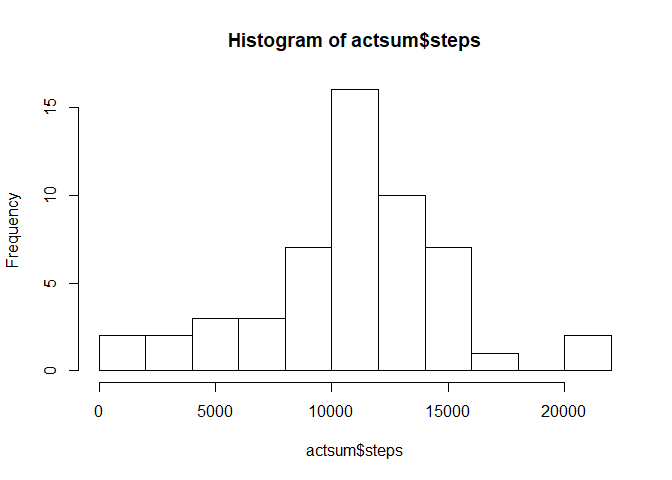
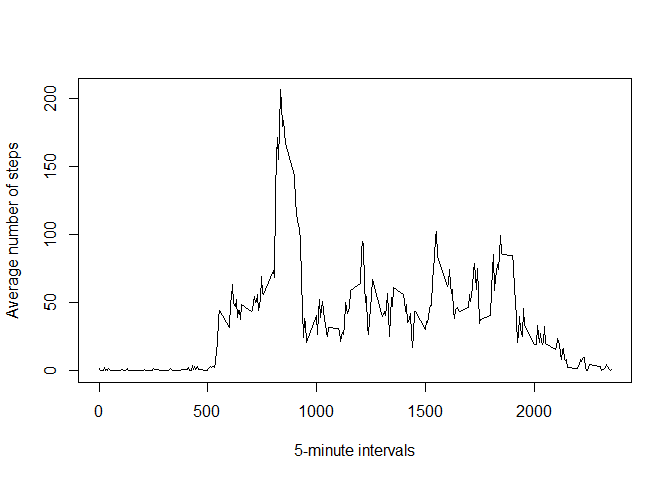
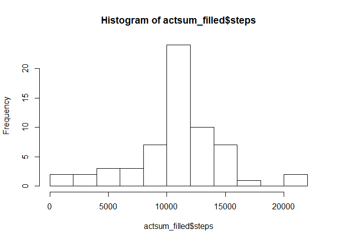
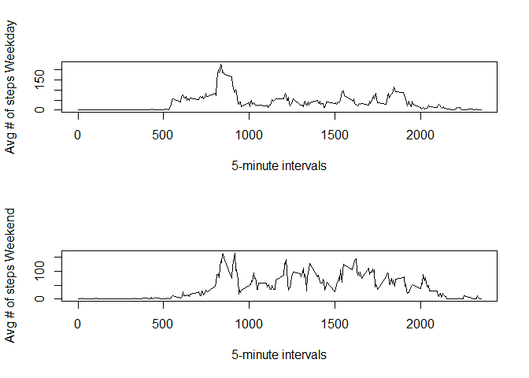

# Reproducible Research: Peer Assessment 1


```r
library(plyr)
```

```
## Warning: package 'plyr' was built under R version 3.3.3
```


## Loading and preprocessing the data


```r
data<-read.csv("activity.csv",sep = ",", header = TRUE)
summary(data)
```

```
##      steps                date          interval     
##  Min.   :  0.00   2012-10-01:  288   Min.   :   0.0  
##  1st Qu.:  0.00   2012-10-02:  288   1st Qu.: 588.8  
##  Median :  0.00   2012-10-03:  288   Median :1177.5  
##  Mean   : 37.38   2012-10-04:  288   Mean   :1177.5  
##  3rd Qu.: 12.00   2012-10-05:  288   3rd Qu.:1766.2  
##  Max.   :806.00   2012-10-06:  288   Max.   :2355.0  
##  NA's   :2304     (Other)   :15840
```

```r
data$date<-as.Date(data$date)
```

## What is mean total number of steps taken per day?


```r
actsum<-ddply(data, "date", summarize, 
              steps=sum(steps),
              interval=sum(interval))

hist(actsum$steps,breaks=10)
```

<!-- -->

```r
mean_steps<-mean(actsum$steps,na.rm=TRUE)
median_steps<-median(actsum$steps,na.rm=TRUE)

cat("Mean:",mean_steps,
    "\nMedian:",median_steps)
```

```
## Mean: 10766.19 
## Median: 10765
```


## What is the average daily activity pattern?


```r
dailypatt<-aggregate(steps~interval,
                     data=data,
                     FUN=mean)

plot(dailypatt,type="l",
     xlab="5-minute intervals",
     ylab="Average number of steps")
```

<!-- -->

```r
max<-dailypatt[which.max(dailypatt$steps),]

cat("The 5-minute interval that contains, on average, the maximum number of steps is", max$interval,
    "with",max$steps,"steps")
```

```
## The 5-minute interval that contains, on average, the maximum number of steps is 835 with 206.1698 steps
```


## Imputing missing values

### Counting missing values


```r
NAs<-is.na(data$steps)
cat("Total number of missing values:",sum(NAs))
```

```
## Total number of missing values: 2304
```

### Filling missing data


```r
data_filled<-data

for (i in 1:length(data$steps)) {
        if (is.na(data[i,1])) {
                data_filled[i,1]<-dailypatt[which(dailypatt$interval==data[i,3]),2]
        }
}

NAs<-is.na(data_filled$steps)
cat("Total number of missing values:",sum(NAs))
```

```
## Total number of missing values: 0
```

### New data histogram, mean and median


```r
actsum_filled<-ddply(data_filled, "date", summarize, 
              steps=sum(steps),
              interval=sum(interval))

actsum_filled<-actsum_filled[complete.cases(actsum_filled),]

hist(actsum_filled$steps,breaks=10)
```

<!-- -->

```r
newmean_steps<-mean(actsum_filled$steps)
newmedian_steps<-median(actsum_filled$steps)

cat("New mean:",newmean_steps,
    "\nOld mean:",mean_steps,
    "\n\n\nNew Median",newmedian_steps,
    "\nOld Median:",median_steps)
```

```
## New mean: 10766.19 
## Old mean: 10766.19 
## 
## 
## New Median 10766.19 
## Old Median: 10765
```


By filling the missing data with the average number of steps for that 5-minute interval, the mean will not change, but the median will tend to get closer to the mean. The variability of the data is also expected to reduce.


## Are there differences in activity patterns between weekdays and weekends?


```r
for (i in 1:length(data_filled$steps)) {
        if (weekdays(data_filled[i,2])=="sábado") {
                data_filled$day[i]<-"weekend"
        } else if (weekdays(data_filled[i,2])=="domingo") {
                data_filled$day[i]<-"weekend" 
        } else {
                data_filled$day[i]<-"weekday"
        }
}
```


```r
weekday<-data_filled[which(data_filled$day=="weekday"),]
weekend<-data_filled[which(data_filled$day=="weekend"),]

weekdaypatt<-aggregate(steps~interval,
                       data=weekday,
                       FUN=mean)
weekendpatt<-aggregate(steps~interval,
                       data=weekend,
                       FUN=mean)

par(mfrow=c(2,1))

plot(weekdaypatt,type="l",
     xlab="5-minute intervals",
     ylab="Avg # of steps Weekday")

plot(weekendpatt,type="l",
     xlab="5-minute intervals",
     ylab="Avg # of steps Weekend")
```

<!-- -->
